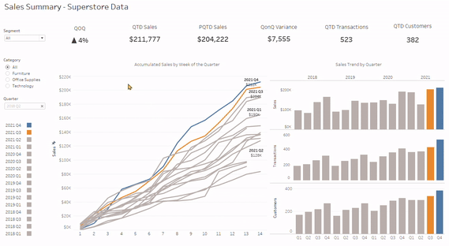
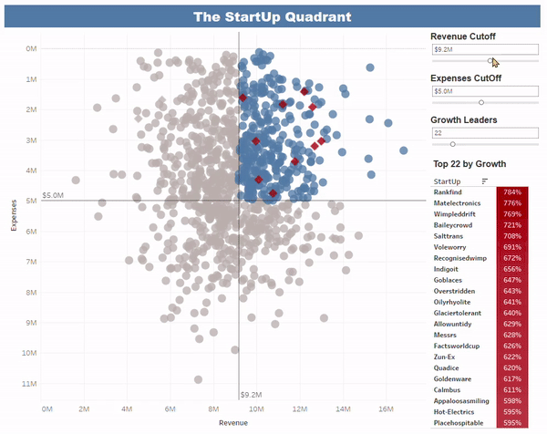
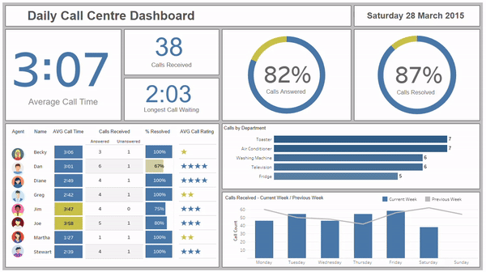
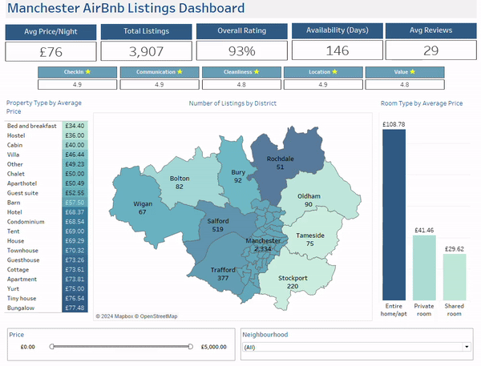
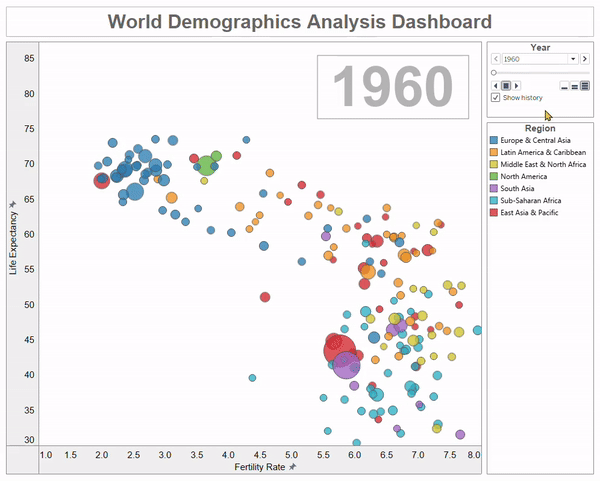

# Data Visualisation & Dashboard Design

## Sales Summary Executive Dashboard

Prior to sitting the Tableau Data analyst exam, I wanted to give myself more experience using Tableau, so I took inspiration from one of Tableaus’ dashboards in this [article]( https://www.tableau.com/learn/articles/sales-dashboards-examples-and-templates).

I built the dashboard using the Superstore dataset; this can be used by senior executives to track sales performance relative to prior quarters.

[Click here](https://public.tableau.com/shared/C24RT2WZ4?:display_count=n&:origin=viz_share_link) to view on Tableau Public.

## StartUp Quadrant Dashboard

This was a challenge on a Tableau course I completed.  A board of directors were reviewing 1000 potentially interesting startups and wanted help in decided which one they were going to invest in.  The criterion for selecting the best investment was: High Revenue, Low Expenses and Top Growth.

The interactive dashboard gives the user the feeling of mining the data themselves with the three parameter slide controllers where they are able to select their preferred startup growth and revenue value.  And as the growth leader parameter controller is moved each new startup appears in the visible quarter of the grid as a red diamond for ease of visibility.

[Click here](https://public.tableau.com/shared/7QC9W6QMG?:display_count=n&:origin=viz_share_link) to view on Tableau Public.

## Daily Call Centre Dashboard

This was a project to create a call centre dashboard, to give the management team visibility of daily/weekly call stats and call agent performance.  With emphasis particularly on average call time, call waiting, calls answered and calls resolved.  

The design is fresh, clean and modern, and well-structured which enables the user to quickly assimilate the data.  With the interactive functionality the user can view call specifics by clicking on the agent photo and/or call by department chart.

[Click here](https://public.tableau.com/views/CallCentreDashboard_17139916267290/Dashboard1?:language=pt-BR&:sid=&:display_count=n&:origin=viz_share_link) to view on Tableau Public.

## Manchester AirBnB Listings Dashboard

This dashboard project was created using an AirBnB dataset where data for Manchester, UK was used.  

The goal was to create an interactive dashboard utilising the data provided to give an overview and analysis of the AirBnB listing market over the different Manchester districts and neighbourhoods.

[Click here](https://public.tableau.com/views/ManchesterAirBnBListingsDashboard/Dashboard1?:language=en-GB&:sid=&:display_count=n&:origin=viz_share_link) to view on Tableau Public.

## World Demographic Analysis Dashboard

This was a Tableau course project I completed.  The course references a Ted Talk episode on 'New insights on poverty' by researcher Hans Rosling.

This visualisation utilises Tableaus animation functionality showing how populations of countries across the world have developed over the past 50 years. Specifically, with trends in fertility, life expectancy and population.
You can see the change in relationship between industrialised countries (small families - long lives) and developing countries (large families - short lives) as time passes.

[Click here](https://public.tableau.com/views/WorldDemographicsAnalysisDashboard_17158057489460/WorldDemographics?:language=pt-BR&:sid=&:display_count=n&:origin=viz_share_link) to view on Tableau Public.

##### END

